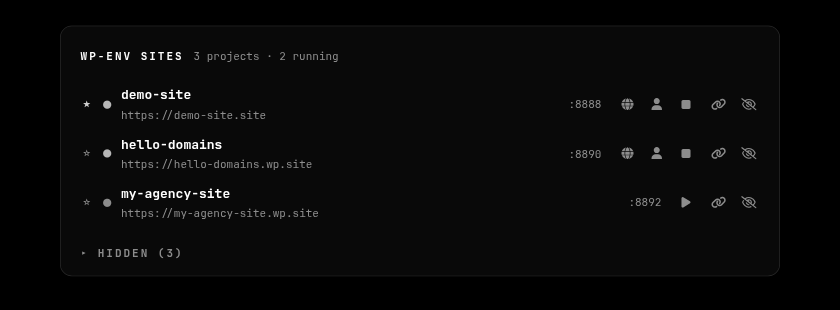
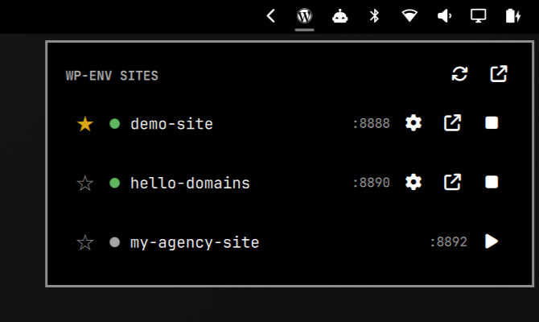

# omarchy-wp-env-ui

[](https://github.com/andreilupu/omarchy-wp-env-ui-app/actions/workflows/ci.yml)

A control panel for [wp-env](https://www.npmjs.com/package/@wordpress/env) WordPress dev sites on [Omarchy](https://omarchy.org). It discovers every wp-env project on the machine (any directory with a `.wp-env.json`), shows live status straight from Docker, and lets you create, start, stop, and open sites — from a desktop app, a taskbar widget, or the CLI. No terminal needed for any of it, including serving sites at real HTTPS domains like `https://my-project.site`.



## Features

- **One list of every wp-env project** on the machine, with live state, ports, favourites, and per-site logs that stream while a site starts.
- **Create a WordPress site from the UI** — a slug is all it takes; a free port pair is picked automatically and the site starts right away.
- **Local HTTPS domains with real TLDs** (`my-project.site`, `client.dev`, anything) through a local Caddy proxy with a locally-trusted certificate — the URL shape external services (GCP OAuth, GA4, YouTube API, …) accept, unlike `.test`/`.localhost`. One-time setup happens from a button.
- **Omarchy-native look**: the app follows your active Omarchy theme (palette and monospace font) and mirrors the shell's panel design; a Quickshell **bar widget** offers the same controls from the taskbar.
- **Hide/restore** projects you don't care about right now; favourites sort first everywhere.
- Instant startup: background filesystem scans, a persisted project cache, and a systemd user service that keeps the server warm.

## Requirements

- Omarchy (or any Arch-ish system with Hyprland for the widget; the server and CLI are plain Linux) with Docker running
- `node`/`npx` (mise-managed installs are handled — scripts fix up `PATH` themselves), `python3` ≥ 3.10, `curl`, `jq`
- A Chromium-family browser for app-mode windows
- Optional, for local domains: `caddy` (installed by the setup step)

## Install

**From a git checkout:**

```bash
./install.sh
```

**As an Arch package** (AUR-ready — see `packaging/PKGBUILD`):

```bash
cd packaging && makepkg -si   # system-wide under /usr
wp-env-ui-setup               # then once per user
```

**With mise** (per-user, no sudo; installs the release tarball attached to every `v*` tag):

```bash
mise use -g "github:andreilupu/omarchy-wp-env-ui-app[asset_pattern=omarchy-wp-env-ui-*.tar.gz,bin_path=bin]@latest"
wp-env-ui-setup
```

All three layouts are supported by every script. `wp-env-ui-setup` is the single per-user setup entry point: it installs + enables the `wp-env-ui.service` systemd user unit (restarting it on re-runs so updates take effect), installs the "wp-env" launcher entry, and copies the bar widget into `~/.config/omarchy/plugins/`. For mise installs it points the unit and `.desktop` entries at the mise shims so upgrades don't break them.

Then launch **wp-env** from the app launcher (`SUPER + SPACE`).

## Using it

### Creating a site

**New site** → type a slug → **Create & start**. The server writes `$WP_ENV_SITES_DIR/<slug>/.wp-env.json` with a free port pair and starts the site; the first start downloads WordPress and can take a few minutes (watch the **Log**). Fresh sites log in with `admin` / `password`.

### Local HTTPS domains

Open a site's **Domain** dialog. The first time, click **Set up local domains** — it runs the privileged setup for you (polkit dialog when an agent is running, otherwise a terminal window with a sudo prompt) and streams the log inline. The CLI equivalent is `sudo wp-env-domains-setup`.

Setup installs Caddy on `127.0.0.2:443` (a dedicated loopback address, so it coexists with other local proxies on `127.0.0.1`) with its local CA trusted in the system store and its admin API on `127.0.0.1:2029`, plus a small root-owned `/etc/hosts` helper guarded by a sudoers rule scoped to exactly that helper. After that, everything is automatic and prompt-free:

- Assigning a domain adds it to a managed `/etc/hosts` block, and the server keeps Caddy's reverse-proxy routes in sync as sites start and stop.
- WordPress adopts the URL: `WP_HOME`/`WP_SITEURL` and a proxy-awareness mu-plugin are merged into the project's `.wp-env.override.json` (and fully removed with the domain). The mu-plugin trusts `X-Forwarded-Proto` for `is_ssl()` and undoes wp-env's habit of appending its internal port to configured URLs; Caddy rewrites the container's `http://` redirects. A running site restarts to apply changes.
- Sites created from the UI get `<slug>.wp.site` automatically once the proxy is set up; Open/Admin use the domain.

### Organizing the list

- **Favourites** — the star on a card (or `f` in the bar panel) pins a site to the top everywhere.
- **Hide** — removes a site from the main list and the bar widget without stopping or deleting anything; the collapsible **Hidden** panel at the bottom restores it.

### Bar widget



`shell-plugin/wp-env-ui/` is the taskbar version of the control panel. Enable it with `omarchy plugin enable wp-env-ui` and add `{"id": "wp-env-ui"}` to a `bar.layout` section in `~/.config/omarchy/shell.json`.

- **Icon**: WordPress mark, dimmed when nothing runs. Left-click toggles the panel, right-click opens the full app, middle-click refreshes.
- **Panel**: every site with star, status dot, port, and wp-admin / open / start / stop buttons. Keyboard: `j`/`k` move, `Enter` opens (or starts), `x` stops, `f` favourites, `r` refreshes, `o` opens the full app, `Esc` closes.
- If the server isn't running, the panel offers to start it. Widget settings (`serverPort`, `refreshIntervalSec`) live in the bar's widget settings.

## CLI reference

| Command | What it does |
| --- | --- |
| `wp-env-ui` | Start the server if needed and open the app (`--server-only` skips the window) |
| `wp-env-ui-setup` | Per-user setup/refresh: systemd unit, launcher entry, bar widget |
| `wp-env-register-site <slug> ["Name"] [port]` | Create a site + a dedicated app-launcher entry for it |
| `wp-env-launch <slug>` | Start-if-needed + open one site (Exec target of per-site entries) |
| `wp-env-stop <slug>\|--all` | Stop one site or every site under the sites dir |
| `wp-env-unregister-site <slug> [--purge]` | Remove a site's launcher entry; `--purge` destroys the environment too |
| `sudo wp-env-domains-setup` | One-time root setup for local HTTPS domains (the UI button runs this) |

## Configuration

Environment variables for the server (set them on the systemd unit or a wrapper):

| Variable | Default | Meaning |
| --- | --- | --- |
| `WP_ENV_UI_PORT` | `8710` | UI/API port |
| `WP_ENV_UI_ROOTS` | `~/workspace` | Colon-separated scan roots |
| `WP_ENV_SITES_DIR` | `~/workspace/wordpress/omarchy/sites` | Where UI-created sites live (always scanned) |
| `WP_ENV_UI_DOMAIN_BASE` | `wp.site` | Suggestion base for auto-assigned domains |
| `WP_ENV_UI_CADDY_ADMIN` | `http://127.0.0.1:2029` | Caddy admin API address |

Projects rescan in the background every 5 minutes or via **Rescan** (the UI keeps showing the last known list meanwhile). Server logs go to `journalctl --user -u wp-env-ui` (or `~/.cache/wp-env-ui.log`, rotated at 1 MB, without systemd).

## How it works

- `server/wp-env-ui.py` — a stdlib-Python HTTP server on `127.0.0.1:8710`. It scans the roots for `.wp-env.json` files (cache persisted to `~/.local/state/wp-env-ui/`), reads live status from Docker by computing wp-env's docker-compose project names (current `wp-env-<dir>-<hash>` and legacy full-md5 formats), runs `npx @wordpress/env` for actions, and manages Caddy routes through the admin API. The UI (`server/page.html`) injects the active Omarchy theme palette on every page load.
- `bin/wp-env-ui` — the `.desktop` Exec target: pings the server, starts it (systemd unit preferred), opens the app via `omarchy-launch-webapp`.
- `libexec/wp-env-hosts-helper` — the only privileged runtime piece: adds and removes `127.0.0.2 <domain>` lines inside a marked `/etc/hosts` block, with strict input validation.

Security: the server binds localhost only, acts only on project paths it discovered itself, and rejects requests whose `Host`/`Origin` isn't localhost (CSRF/DNS-rebinding protection — otherwise any website could drive the API with no-preflight POSTs).

## Development

```bash
python3 -m unittest discover -s tests -v
```

Stdlib-only tests (50+) cover the pure helpers, state persistence, the hosts helper (against a temp hosts file, including injection rejection), and the HTTP API end-to-end on an ephemeral port. CI runs them on every push.

**Releasing:** push a `v<version>` tag — CI attaches the tarball that the mise install consumes. For the AUR, bump `pkgver` in `packaging/PKGBUILD`, then `updpkgsums` and `makepkg --printsrcinfo > .SRCINFO`.

## License

[MIT](LICENSE)

The WordPress logo is a registered trademark of the WordPress Foundation; it is used here to identify a tool for WordPress development, with no affiliation or endorsement implied.
